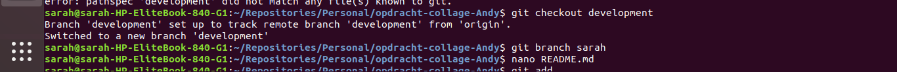
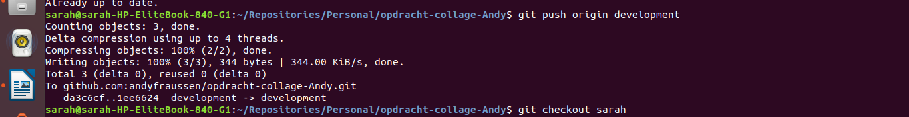

Opdracht 2 Git: Bijdragen.

eerste stappen:

ga naar je eigen map personal a.d.h.v. cd (naam map)
clone je git d.m.v. git clone 

volgende stappen: 

ga naar de map van de persoon die je gecloned hebt bv. cd (map persoon)
voer vervolgens een git branch -a uit.

Volgende stap:

git pull origin development

Volgende stap:

git checkout development

Nu doen we de volgende 4 stappen:

1. git branch (uw naam)
2. nano README.md
3. git add .
4. git commit -m “add random text”

Nu gaan we de volgende 3 stappen doen:

1. git push origin (uw naam)
2. git merge origin (uw naam)
3. git push origin development

Dan zie je dit:

Vervolgens zie je dit staan online:

